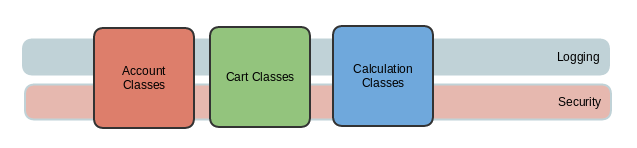

AOP 개념에 대해서는 이미 잘 정리된 글들이 많기 때문에, 참고 링크로 대체합니다.

## AOP(Aspect Oriented Programming)를 적용하는 이유?
일반적으로, 라라벨에서 코드를 작성하다보면 아래처럼 신규 유저를 생성한다는 비즈니스 로직 이외에도 
트랙잭션이나 로깅처럼 공통적인 기능에 대한 코드가 여러 클래스에서 사용되게 됩니다.

```php
class DirtyCreateUserService implements CreateUserService
{
    /* ... */

    public function run(string $email, string $password): void
    {
        DB::transaction(function () use ($email, $password) {
            $user = new User();
            $user->setAttribute('email', $email);
            $user->setAttribute('password', $this->hasher->make($password));
            $user->save();
        });

        Log::info("Created User: {$email}");
    }
    
    /* ... */
}
```

개발 초기엔 무시할 정도겠지만, 시간이 지남에 따라 인증, 보안과 같은 추가적인 횡단 관심사(Cross-Cutting Concerns)들이 점점 늘어나고,
여러 곳에서 같은 코드가 중복될 겁니다.


<p style="text-align: center; margin-bottom: 2rem;"><sub>출저: https://developers.shopware.com/blog/2015/07/23/cross-cutting-concerns/</sub></p>

때문에 위에 예시로 들었던 `DirtyCreateUserService` 클래스 같은 스타일로 코드를 계속해서 작성하다 보면 __비즈니스 로직에 대한 코드__와
__공통적인 기능에 대한 코드__가 섞여 코드 가독성이 떨어지고, 공통 부분에 변동사항이 생겼을 때 코드를 변경하기 어려워집니다.
결과적으로, 이러한 스타일은 __Don't Repeat Yourself__와 __SOLID 원칙 중에 Single Responsibility__를 따르지 않는 코드를 양산하여 
유지보수를 어렵게 만듭니다.

지금부터, 어떻게 AOP를 적용해 위에 문제들을 해결하는지 알아보도록 하겠습니다.

## 이미 라라벨에서 AOP가 적용된 곳을 찾아볼 수 있다?
놀랍게도, 라라벨에서 이미 AOP가 적용된 부분들을 찾아볼 수 있습니다. 대표적으로 어떤 것들이 있을까요?

#### 1. Request Validation
라라벨에서 요청에 대한 유효성 검사는 여러 컨트롤러에서 반복적으로 필요한 작업입니다. 어떤가요, 이 부분도 횡단 관심사로 보이지 않나요?

라라벨에서는 아래와 같이 Request 유효성 검사에 대해서 아래와 같이 컨트롤러 메서드에서 직접 호출하여 확인할 수 있습니다.

```php
public function store(Request $request): Response
{
    $validated = $request->validate([
        'email' => 'required|max:255',
        'password' => 'required',
    ]);
    // ...
}
```

이런 스타일로 코드를 작성하면 어떻게 될까요? 유효성 검사가 필요한 곳 마다 비슷한 코드를 작성하게 될 겁니다.

<br/>

하지만, 실전에서 이렇게 코드를 짜는 경우는 별로 없죠. 여러분은 이미 유효성 검사를 매번 확인하지 않아도 되는 방법을 알고 있습니다.

```php
class CreateUserRequest extends FormRequest
{
    public function rules(): array
    {
        return [
            'email' => 'required|max:255',
            'password' => 'required',
        ];
    }
}
```

```php
public function store(CreateUserRequest $request): Response
{
    // ...
}
```

라라벨에선 `Illuminate\Foundation\Http\FormRequest`를 상속받은 요청 클래스를 컨트롤러 메서드에서 인자 타입으로 선언하면, 
해당 컨트롤러 메서드를 호출하기 전에 알아서 유효성 검사를 알아서 하게 됩니다. 

이게 도대체 어떻게 가능한 걸까요? 정답은, `Illuminate\Foundation\Providers\FormRequestServiceProvider`에 있습니다.

```php
public function boot()
{
    $this->app->afterResolving(ValidatesWhenResolved::class, function ($resolved) {
        $resolved->validateResolved();
    });
    
    // ...
}
```

`Illuminate\Foundation\Http\FormRequest`는 `Illuminate\Contracts\Validation\ValidatesWhenResolved` 인터페이스의 구현체입니다.

라라벨에서 모든 컨트롤러 메서드에 대한 호출은 컨테이너(__IOC Container__)를 통해 종속성을 주입하기 때문에, 
컨테이너에서 `CreateUserRequest`에 대한 인스터스를 생성한 후, `afterResolving` 사이클에서 유효성 검사를 호출하게 됩니다.

<br/>

이렇게, 우리는 이미 컨트롤러에서 유효성 검사라는 횡단 관심사를 분리해서 사용하고 있습니다.

#### 2. Middleware

## 라라벨 파이프라인을 활용한 구현

## 또 다른 선택지, Go! AOP

## 참고 링크
- http://go.aopphp.com/docs/introduction/
- https://www.infoworld.com/article/3040557/my-two-cents-on-aspect-oriented-programming.html#:~:text=AOP%20(aspect%2Doriented%20programming),to%20be%20adaptable%20to%20changes.
- https://medium.com/@ivastly/application-instrumentation-with-aspect-oriented-programming-in-php-18b1defa682
