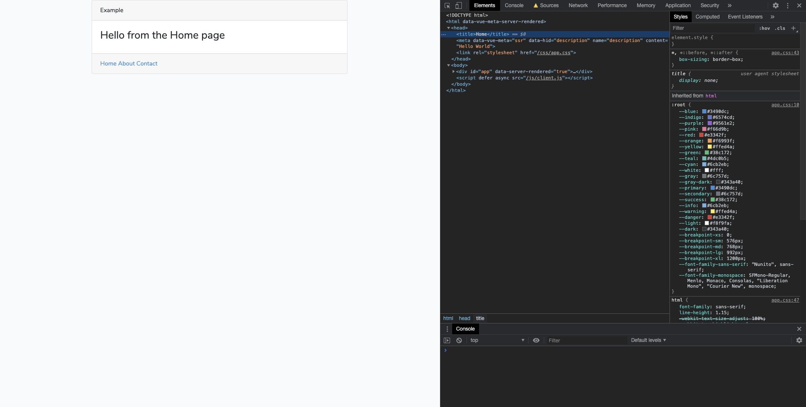

들어가기에 앞서, 해당 글은 `spatie/laravel-server-side-rendering` 라이브러리를 사용하는 것을 전제로 이야기 합니다.

## 해당 글을 작성하게 된 계기
저는 이전에 백엔드와 프론트 영역에 구분 없이 업무를 했었는데,
신입이던 당시에 백엔드 외에 프론트에 대한 인프라까지 고려해야 하는 게 부담스럽게 느껴 
단일로 관리가 가능한 PHP V8 익스텐션을 사용한 SSR 처리에 관심을 갖게 되어 여러가지 시도를 해봤습니다.
해당 글에선, 흔히 찾아볼 수 있는 예제에서 제공하지 않는 스타일을 소개하고자 합니다.

## 일반적인 예제
`spatie/laravel-server-side-rendering` 라이브러리에서 가이드하는 기본 예제를 보며 이야기를 해보도록 하겠습니다.

```js
// resources/assets/js/app.js

import Vue from 'vue';
import App from './components/App';

export default new Vue({
    render: h => h(App),
});
```
단순한 Vue 애플리케이션 코드

```js
// resources/assets/js/app-client.js

import app from './app';

app.$mount('#app');
```
CSR 처리를 위한 코드

```js
// resources/assets/js/app-server.js

import app from './app';
import renderVueComponentToString from 'vue-server-renderer/basic';

renderVueComponentToString(app, (err, html) => {
    if (err) {
        throw new Error(err);
    }

    dispatch(html);
});
```
SSR 처리를 위한 코드

```html
<html>
    <head>
        <title>My server side rendered app</title>
        <script defer src="{{ mix('app-client.js') }}">
    </head>
    <body>
        {!! ssr('js/app-server.js')->render() !!}
    </body>
</html>
```

관련 자료를 찾아보면 보통 예제가 위와 같은 수준에 가이드를 해주더군요. 
하지만, 저는 예제들을 보며 헤더 부분에 대한 처리에 대한 의문이 떠올랐습니다.
[구글 검색엔진이 SPA 애플리케이션의 SEO도 잘 처리](https://vuejsdevelopers.com/2018/04/09/single-page-app-seo/)하는
것을 기존에도 알고 있었지만, 이 부분을 이유로 헤더 부분에 대한 처리는 가이드를 찾아볼 수가 없더군요. 
SSR 방식을 채택하는데 여러 이유가 있지만, 저는 전체 마크업을 서버 측에서 렌더링해서 내려주는 부분을 중요하게 생각합니다. 
때문에 이 부분에 대한 의문을 꼭 해소를 하고 싶었습니다.

## 멀티 페이지에 대한 예제
더 자료를 찾던 중에, 정답이 있을 거 같은 한 [e-book](http://digital.kyobobook.co.kr/digital/ebook/ebookDetail.ink?barcode=480D180321400)을 발견해서 구입하게 됐습니다.
아쉽게도 제가 원했던 답은 없었으나 해당 책에선, 멀티 페이지에 대한 SSR 처리를 다음과 같이 처리하더군요.

```php
// routes/web.php

Route::get('/', 'ListingController@get_home_web');
...
```

```php
// routes/api.php

Route::get('/', 'ListingController@get_home_api');
...
```

```php
class ListingController extends Controller
{
    ...
    public function get_home_web(Request $request)
    {
        $data = $this->get_listing_summaries();
        $data = $this->add_meta_data($data, $request);
        return view('app', ['data' => $data]);
    }

    public function get_home_api()
    {
        $data = $this->get_listing_summaries();
        return response()->json($data);
    }
    ...
}
```

```html
<!DOCTYPE html>
<html>
<head>
    <meta charset="UTF-8">
    <meta http-equiv="X-UA-Compatible" content="IE=edge,chrome=1">
    <meta name="viewport" content="width=device-width,initial-scale=1">
    <title>Vuebnb</title>
    <link rel="stylesheet" href="{{ cdn('css/style.css') }}" type="text/css">
    <link rel="stylesheet" href="{{ cdn('css/vue-style.css') }}" type="text/css">
    <script type="text/javascript">
        window.vuebnb_server_data = "{!! addslashes(json_encode($data)) !!}"
        window.csrf_token = "{{ csrf_token() }}"
        window.cdn_url = "{{ cdn('') }}";
    </script>
</head>
<body>
<div id="app"></div>
<script src="{{ cdn('js/app.js') }}"></script>
</body>
</html>
```
하나의 페이지에 대해서 web과 api로 라우트를 분기(web은 SSR, api는 CSR을 담당하는 형태)해서, 필요한 데이터를 전역변수로 넘겨 사용하는 형태였습니다.
처음엔 이 방식을 통해 헤더 부분을 처리하면 어떨까 싶었지만, 
해당 방식은 하나의 페이지에 대해서 코드를 2번 작성해야 하고,
저는 헤더 부분을 Vue 애플리케이션에서 해결하고 싶었기 때문에 다른 방식이 없을까 더 고민해 봤습니다.

## vue-meta를 사용해 시도한 예제
그러다 우연히, 하나의 [PR](https://github.com/spatie/server-side-rendering/pull/19)을 보게 되었습니다.
바로 spatie 예제에서 나온 `dispatch` 함수의 동작을 이전에 문자열 형태로 반환을 하던 것을 JSON을 통해 주고 받을 수 있게 수정을 했더군요.
(`dispatch`가 어떻게 동작하는지 더 자세히 알고 싶으시다면, `Spatie\Ssr\Renderer` 클래스를 뜯어 보시면 됩니다.) 

저는 여기서 영감을 얻어 vue-meta 라이브러리에서 제공하는 inject 메서드를 사용해 헤더 부분을 같이 넘겨주는 방식을 시도해보기로 했습니다.
하지만, 여기서 한 가지 큰 문제에 부딪히게 되었는데, 
그것은 [setTimeout 같은 `Timer API`를 사용한 코드](https://github.com/nuxt/vue-meta/issues/302)가 문제가 되었습니다. 
원인은 V8 런타임에선 노드나 브라우저 런타임에서만 지원하는 API를 사용할 수가 없더군요. 
이 부분에서 막혀 포기를 했었는데, 작년 말에 감사하게도 vue-meta 2.3 버전 이상부터 이 문제를 우회할 수 있게 업데이트를 해줘서 다시 시도를 하게 되었습니다.

아래는 제가 작성한 예제 코드입니다.

```js
// resource/js/app.js

import VueMeta from 'vue-meta';
import App from './components/App.vue';
import Vue from 'vue';
import router from './router'

Vue.use(VueMeta, {
    tagIDKeyName: 'hid',
    debounceWait: 0,
});

const app = new Vue({
    router,
    render: h => h(App),
});

const { set } = app.$meta().addApp('custom');

set({
    bodyAttrs: { class: 'custom-app' },
    meta: [{ charset: 'utf-8' }]
});

export default app;
```

```js
// resource/js/server.js

import renderVueComponentToString from 'vue-server-renderer/basic';
import app from './app';
import router from './router';

(async () => {
    await new Promise((resolve, reject) => {
        router.push(context.url);
        router.onReady(() => {
            const matchedComponents = router.getMatchedComponents();
            if (!matchedComponents.length) {
                return reject({ code: 404 });
            }
            resolve(app);
        }, reject);
    });

    renderVueComponentToString(app, (err, html) => {
        if (err) {
            throw new Error(err);
        }
        const meta = app.$meta().inject();
        dispatch({
            html: html,
            vueMeta: {
                htmlAttrs: meta.htmlAttrs.text(true),
                headAttrs: meta.headAttrs.text(),
                head: meta.head(true),
                bodyAttrs: meta.bodyAttrs.text(),
                bodyPrepend: meta.bodyPrepend(true),
                bodyAppend: meta.bodyAppend(true),
            },
        });
    })
})();
```
`debounceWait` 옵션을 0으로 주게 되면, setTimeout을 호출하지 않기 때문에, SSR 환경에선 반드시 해당 옵션을 0으로 줘야 합니다.

```php
// resource/views/welcome.blade.php

@php
    $ssr = ssr('js/server.js')->enabled()
        ->context(['url' => request()->path()])
        ->fallback('<div id="app"></div>')
        ->render();
@endphp

<!DOCTYPE html>
<html {!! $ssr['vueMeta']['htmlAttrs'] !!}>
    <head {!! $ssr['vueMeta']['headAttrs'] !!}>
        {!! $ssr['vueMeta']['head'] !!}
        <link rel="stylesheet" href="{{ mix('css/app.css') }}">
    </head>
    <body {!! $ssr['vueMeta']['bodyAttrs'] !!}>
        {!! $ssr['vueMeta']['bodyPrepend'] !!}

        {!! $ssr['html'] !!}

        <script defer async src="{{ mix('js/client.js') }}"></script>
        {!! $ssr['vueMeta']['bodyAppend'] !!}
    </body>
</html>
```
vue-router에서 알맞은 경로에 해당하는 컴포넌트를 찾아 렌더링을 할 수 있게 현재 경로를 컨텍스트로 넘겨줘야 합니다.



브라우저에서 자바스크립트 실행 옵션을 끈 후에, 실행시키면 다음과 같이 원하던 결과가 나오는 것을 확인할 수 있습니다.
하지만, 제가 안내한 예제도 간단한 수준이라 대부분의 경우 렌더링 전에 AJAX 호출을 통해 데이터를 가져와야 하기 때문에, 
실제 프로덕트 레벨에선 더 많은 코드를 작성할 필요가 있습니다.

## 마무리
전체 코드를 보시려면 해당 [링크](https://github.com/cr-lgl/laravel-ssr-example)에서 확인하실 수 있습니다.

### 장점
- PHP 애플리케이션만 관리하면 되기 떄문에, 인프라 관리 부담이 줄어든다.
- 레포 하나로 코드를 관리할 수 있다.

### 단점
- V8 런타임에서 돌아가는 것을 감안하며 JS 코드 작성과 라이브러리를 검수하며 사용해야 한다.
- Nuxt의 Async data, fetch 훅 같은 작업이 필요하면(대부분의 경우 필요하기 떄문에 거의 필수) 직접 구현해야 한다.

결론적으로 저는 장점보다 단점이 더 크다고 느껴, 결국 해당 방식으로 SSR을 처리하기 보다 Nuxt를 사용하는 것을 선호하게 되었습니다.

그냥 이런 방법도 있다라는 정도로 봐주시면 감사하겠습니다.

## 참고 링크
- https://vuejsdevelopers.com/2017/11/27/vue-js-laravel-server-side-rendering-router
- https://vuejsdevelopers.com/2017/11/06/vue-js-laravel-server-side-rendering
- https://github.com/PacktPublishing/Full-Stack-Vue.js-2-and-Laravel-5
- https://rojas.io/vue-js-server-side-rendering-with-php
- https://github.com/spatie/laravel-server-side-rendering